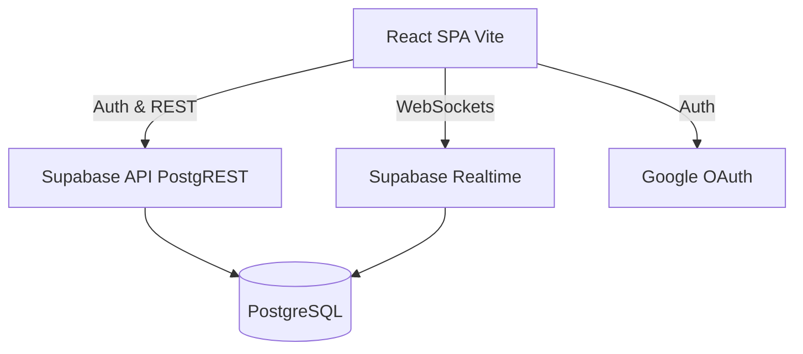

# Architecture Overview

## 1. Purpose
Provide a high-level technical overview of the Group Free Time Scheduler system.

## 2. System Architecture Overview
The system follows a standard modern Serverless / BaaS architecture tailored for fast development, stability, and easy maintenance.
- **Frontend**: Single Page Application (SPA) built with React and Vite. Hosted on Vercel.
- **Backend**: Managed backend via Supabase (PostgreSQL, Auth, Realtime).

## 3. Tech Stack
- **Frontend**: React, Vite, TypeScript, TailwindCSS, Zustand (Global UI State), React Query (Server State), React Router.
- **Backend**: Supabase, PostgreSQL, Row Level Security (RLS).
- **Deployment**: Vercel (Frontend), Supabase Cloud (Backend).

## 4. Architecture Diagram

## 5. Scale Requirements
- Support ~5 concurrent users per group.
- Monolithic frontend with BaaS backend.
- Prioritize clean architecture for easy future expansion.
