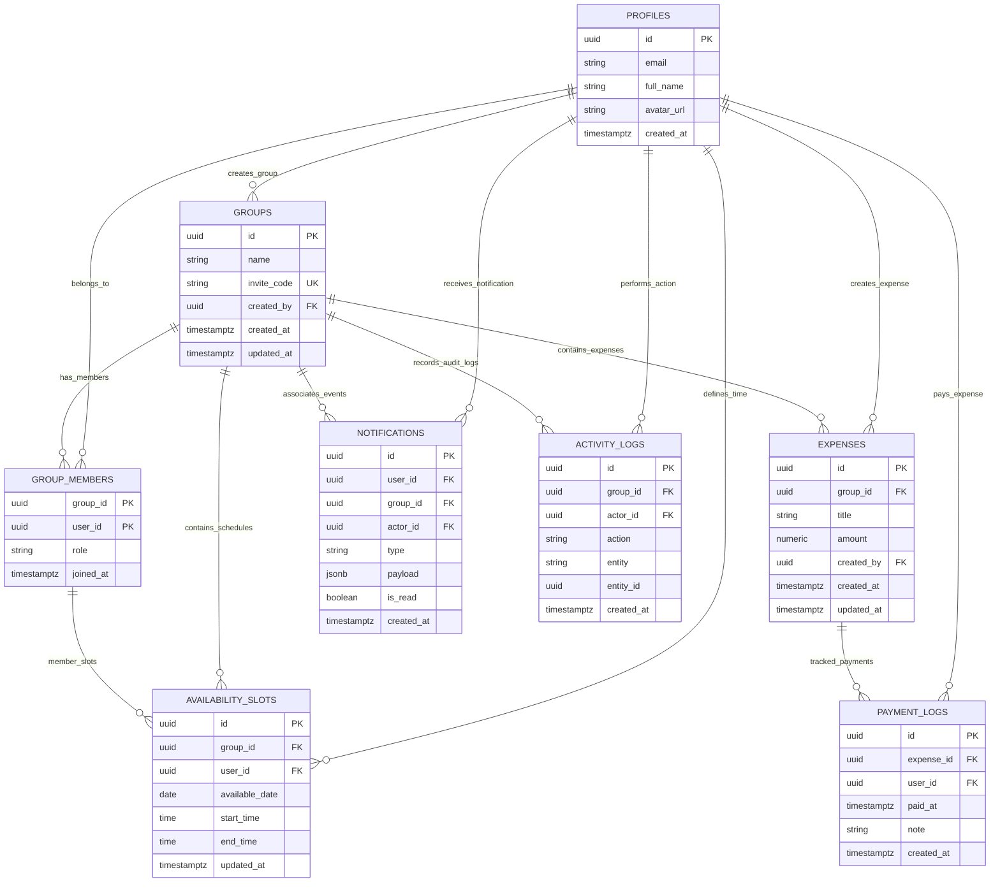
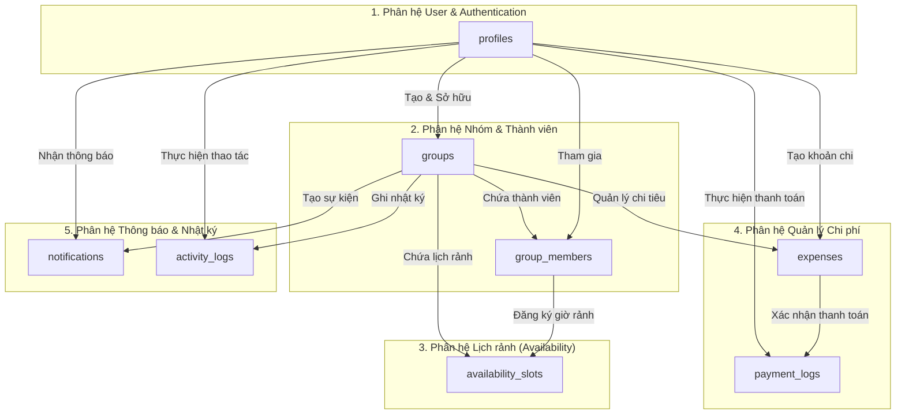

# Dynamic Group Scheduler - Visualizing Database Schema & Relationships

Tài liệu này trực quan hóa toàn bộ sơ đồ cơ sở dữ liệu PostgreSQL (Supabase) của ứng dụng **Group Scheduler**, bao gồm các bảng (tables), thuộc tính (columns), khóa chính/khóa ngoại (PK/FK), quan hệ giữa các bảng (relationships), cùng với ràng buộc toàn vẹn và chiến lược bảo mật RLS.

---

## 1. Sơ đồ Quan hệ Thực thể (Entity Relationship Diagram - ERD)

Dưới đây là sơ đồ ERD tổng quan mô tả chi tiết 8 bảng cơ sở dữ liệu cốt lõi và mối quan hệ tương tác giữa chúng.



---

## 2. Phân vùng Kiến trúc Phân hệ (Domain Modules)

Database được tổ chức thành 5 phân hệ logic phục vụ các tính năng chính của ứng dụng:



---

## 3. Chi tiết Danh mục Bảng (Data Dictionary)

### 3.1. Bảng `profiles` (Hồ sơ người dùng)
Được đồng bộ tự động từ `auth.users` của Supabase thông qua database trigger.

| Tên cột | Kiểu dữ liệu | Ràng buộc | Mô tả |
| :--- | :--- | :--- | :--- |
| `id` | `UUID` | **PK**, `REFERENCES auth.users(id)` | Định danh duy nhất của người dùng |
| `email` | `TEXT` | NOT NULL | Email đăng ký |
| `full_name` | `TEXT` | NULLABLE | Tên hiển thị |
| `avatar_url` | `TEXT` | NULLABLE | Đường dẫn ảnh đại diện |
| `created_at` | `TIMESTAMPTZ` | DEFAULT `now()` | Thời gian tạo tài khoản |

### 3.2. Bảng `groups` (Nhóm / Đội ngũ)
Lưu trữ thông tin không gian làm việc chung của một nhóm.

| Tên cột | Kiểu dữ liệu | Ràng buộc | Mô tả |
| :--- | :--- | :--- | :--- |
| `id` | `UUID` | **PK**, DEFAULT `gen_random_uuid()` | Định danh nhóm |
| `name` | `VARCHAR(255)` | NOT NULL | Tên nhóm |
| `invite_code` | `VARCHAR(20)` | **UNIQUE**, NOT NULL | Mã mời tham gia nhóm (6 ký tự) |
| `created_by` | `UUID` | **FK** `profiles(id)` | Người khởi tạo nhóm |
| `created_at` | `TIMESTAMPTZ` | DEFAULT `now()` | Thời điểm tạo nhóm |
| `updated_at` | `TIMESTAMPTZ` | DEFAULT `now()` | Thời điểm cập nhật |

### 3.3. Bảng `group_members` (Thành viên nhóm)
Bảng liên kết n-n giữa người dùng và nhóm, phân định vai trò cụ thể.

| Tên cột | Kiểu dữ liệu | Ràng buộc | Mô tả |
| :--- | :--- | :--- | :--- |
| `group_id` | `UUID` | **PK**, **FK** `groups(id) ON DELETE CASCADE` | Mã nhóm |
| `user_id` | `UUID` | **PK**, **FK** `profiles(id) ON DELETE CASCADE` | Mã người dùng |
| `role` | `TEXT` | CHECK (`owner`, `admin`, `member`) | Vai trò trong nhóm (mặc định: `member`) |
| `joined_at` | `TIMESTAMPTZ` | DEFAULT `now()` | Thời điểm tham gia |

> [!NOTE]
> Khóa chính phức hợp **`(group_id, user_id)`** đảm bảo một người dùng chỉ tham gia vào cùng 1 nhóm duy nhất 1 lần.

### 3.4. Bảng `availability_slots` (Khung giờ rảnh)
Lưu trữ các mốc thời gian rảnh của thành viên trong nhóm để phục vụ xếp lịch.

| Tên cột | Kiểu dữ liệu | Ràng buộc | Mô tả |
| :--- | :--- | :--- | :--- |
| `id` | `UUID` | **PK**, DEFAULT `gen_random_uuid()` | Định danh khung giờ |
| `group_id` | `UUID` | **FK** `groups(id)` | Mã nhóm |
| `user_id` | `UUID` | **FK** `profiles(id)` | Mã người dùng sở hữu khung giờ |
| `available_date` | `DATE` | NOT NULL | Ngày rảnh (YYYY-MM-DD) |
| `start_time` | `TIME` | NOT NULL | Giờ bắt đầu |
| `end_time` | `TIME` | NOT NULL | Giờ kết thúc |
| `updated_at` | `TIMESTAMPTZ` | DEFAULT `now()` | Thời điểm cập nhật |

> [!IMPORTANT]
> **Ràng buộc đặc biệt**:
> 1. `CONSTRAINT fk_availability_slots_group_member`: Foreign key phức hợp `(group_id, user_id)` tham chiếu tới `group_members(group_id, user_id) ON DELETE CASCADE`. Ràng buộc này đảm bảo chỉ thành viên thực sự của nhóm mới có thể tạo slot.
> 2. `CONSTRAINT unique_user_availability_slot`: `UNIQUE(group_id, user_id, available_date, start_time, end_time)` ngăn ngừa trùng lặp khung giờ.

### 3.5. Bảng `expenses` (Khoản chi tiêu chung)
Quản lý các khoản chi dùng chung trong nhóm (tiền điện, tiền nhà, ăn uống, v.v.).

| Tên cột | Kiểu dữ liệu | Ràng buộc | Mô tả |
| :--- | :--- | :--- | :--- |
| `id` | `UUID` | **PK**, DEFAULT `gen_random_uuid()` | Định danh khoản chi |
| `group_id` | `UUID` | **FK** `groups(id) ON DELETE CASCADE` | Nhóm áp dụng khoản chi |
| `title` | `VARCHAR(255)` | NOT NULL | Tiêu đề / Mô tả khoản chi |
| `amount` | `NUMERIC(10,2)` | NOT NULL, CHECK (`amount >= 0`) | Số tiền (VNĐ / USD) |
| `created_by` | `UUID` | **FK** `profiles(id) ON DELETE SET NULL` | Người nhập khoản chi |
| `created_at` | `TIMESTAMPTZ` | DEFAULT `now()` | Ngày tạo khoản chi |
| `updated_at` | `TIMESTAMPTZ` | DEFAULT `now()` | Ngày cập nhật |

### 3.6. Bảng `payment_logs` (Nhật ký thanh toán chi phí)
Ghi nhận ai đã thực hiện thanh toán/xác nhận cho khoản chi nào.

| Tên cột | Kiểu dữ liệu | Ràng buộc | Mô tả |
| :--- | :--- | :--- | :--- |
| `id` | `UUID` | **PK**, DEFAULT `gen_random_uuid()` | Định danh giao dịch |
| `expense_id` | `UUID` | **FK** `expenses(id) ON DELETE CASCADE` | Khoản chi tương ứng |
| `user_id` | `UUID` | **FK** `profiles(id) ON DELETE CASCADE` | Thành viên đã thanh toán |
| `paid_at` | `TIMESTAMPTZ` | DEFAULT `now()` | Thời điểm thanh toán |
| `note` | `TEXT` | NULLABLE | Ghi chú thanh toán |
| `created_at` | `TIMESTAMPTZ` | DEFAULT `now()` | Ngày tạo bản ghi |

> [!NOTE]
> `CONSTRAINT unique_user_expense_payment`: `UNIQUE (expense_id, user_id)` bảo đảm mỗi thành viên chỉ có 1 bản ghi xác nhận cho mỗi khoản chi.

### 3.7. Bảng `notifications` (Thông báo người dùng)
Lưu thông báo gửi tới người dùng khi có sự kiện diễn ra trong nhóm.

| Tên cột | Kiểu dữ liệu | Ràng buộc | Mô tả |
| :--- | :--- | :--- | :--- |
| `id` | `UUID` | **PK**, DEFAULT `gen_random_uuid()` | Định danh thông báo |
| `user_id` | `UUID` | **FK** `profiles(id) ON DELETE CASCADE` | Người nhận thông báo |
| `group_id` | `UUID` | **FK** `groups(id) ON DELETE CASCADE` | Nhóm phát sinh thông báo |
| `actor_id` | `UUID` | **FK** `profiles(id) ON DELETE CASCADE` | Người thực hiện hành động tạo ra thông báo |
| `type` | `VARCHAR(50)` | CHECK (`USER_JOINED`, `USER_LEFT`, `AVAILABLE_UPDATED`, `PAYMENT_MARKED`, `EXPENSE_TRACKED`) | Loại thông báo |
| `payload` | `JSONB` | DEFAULT `'{}'::jsonb` | Dữ liệu bổ sung dạng JSON |
| `is_read` | `BOOLEAN` | DEFAULT `FALSE` | Trạng thái đã đọc hay chưa |
| `created_at` | `TIMESTAMPTZ` | DEFAULT `now()` | Thời điểm thông báo |

### 3.8. Bảng `activity_logs` (Nhật ký hoạt động nhóm)
Nhật ký audit trail ghi nhận tất cả hành động thay đổi dữ liệu trong nhóm để truy vết.

| Tên cột | Kiểu dữ liệu | Ràng buộc | Mô tả |
| :--- | :--- | :--- | :--- |
| `id` | `UUID` | **PK**, DEFAULT `gen_random_uuid()` | Định danh bản ghi audit |
| `group_id` | `UUID` | **FK** `groups(id) ON DELETE CASCADE` | Nhóm xảy ra hoạt động |
| `actor_id` | `UUID` | **FK** `profiles(id) ON DELETE CASCADE` | Tác nhân thực hiện |
| `action` | `VARCHAR(50)` | CHECK (`CREATE_GROUP`, `USER_JOINED`, `USER_LEFT`, `UPDATE_AVAILABILITY`, `CREATE_EXPENSE`, `PAYMENT_MARKED`) | Loại thao tác |
| `entity` | `VARCHAR(50)` | NOT NULL | Tên thực thể tác động (vd: `expense`, `slot`) |
| `entity_id` | `UUID` | NOT NULL | ID của thực thể bị tác động |
| `created_at` | `TIMESTAMPTZ` | DEFAULT `now()` | Thời điểm ghi log |

---

## 4. Ma trận Quan hệ Khóa Ngoại & Hành vi Xóa (Foreign Key Matrix)

| Bảng nguồn (Child) | Cột nguồn | Bảng đích (Parent) | Cột đích | Tỷ lệ quan hệ | Thao tác Xóa (On Delete) |
| :--- | :--- | :--- | :--- | :---: | :--- |
| `groups` | `created_by` | `profiles` | `id` | N : 1 | `RESTRICT` |
| `group_members` | `group_id` | `groups` | `id` | N : 1 | `CASCADE` |
| `group_members` | `user_id` | `profiles` | `id` | N : 1 | `CASCADE` |
| `availability_slots` | `(group_id, user_id)` | `group_members` | `(group_id, user_id)` | N : 1 | `CASCADE` |
| `expenses` | `group_id` | `groups` | `id` | N : 1 | `CASCADE` |
| `expenses` | `created_by` | `profiles` | `id` | N : 1 | `SET NULL` |
| `payment_logs` | `expense_id` | `expenses` | `id` | N : 1 | `CASCADE` |
| `payment_logs` | `user_id` | `profiles` | `id` | N : 1 | `CASCADE` |
| `notifications` | `user_id` | `profiles` | `id` | N : 1 | `CASCADE` |
| `notifications` | `group_id` | `groups` | `id` | N : 1 | `CASCADE` |
| `notifications` | `actor_id` | `profiles` | `id` | N : 1 | `CASCADE` |
| `activity_logs` | `group_id` | `groups` | `id` | N : 1 | `CASCADE` |
| `activity_logs` | `actor_id` | `profiles` | `id` | N : 1 | `CASCADE` |

---

## 5. Chỉ mục Tối ưu hóa Hiệu năng (Indexes)

| Tên Chỉ Mục (Index Name) | Bảng | Các cột được đánh chỉ mục | Mục đích tối ưu |
| :--- | :--- | :--- | :--- |
| `idx_availability_slots_group_id` | `availability_slots` | `group_id` | Lấy danh sách slot theo nhóm |
| `idx_availability_slots_user_id` | `availability_slots` | `user_id` | Lấy danh sách slot của người dùng |
| `idx_availability_slots_group_date` | `availability_slots` | `(group_id, available_date)` | Tối ưu hóa truy vấn xem lịch rảnh theo nhóm & ngày |
| `idx_expenses_group_id` | `expenses` | `group_id` | Truy vấn danh sách chi phí của nhóm |
| `idx_expenses_created_by` | `expenses` | `created_by` | Truy vấn chi phí do 1 người tạo |
| `idx_payment_logs_expense_id` | `payment_logs` | `expense_id` | Tối ưu hiển thị tiến độ thanh toán của 1 khoản chi |
| `idx_payment_logs_user_id` | `payment_logs` | `user_id` | Lịch sử thanh toán của cá nhân |

---

## 6. Sơ đồ Chính sách Bảo mật theo Hàng (Row Level Security - RLS)

Supabase sử dụng PostgreSQL RLS để đảm bảo dữ liệu chỉ được truy cập bởi đúng thành viên có quyền trong nhóm:

```mermaid
flowchart LR
    Client([Client Request / Auth JWT]) --> RLS{RLS Evaluation}

    subgraph Rules["Chính sách Phân quyền RLS"]
        RLS -->|auth.uid = user_id| SelfAccess["Chỉnh sửa profile / slot cá nhân / notification cá nhân"]
        RLS -->|EXISTS in group_members| GroupAccess["Xem dữ liệu nhóm, expenses, availability, activity_logs"]
        RLS -->|role IN ('owner', 'admin')| AdminAccess["Sửa/Xóa khoản chi & Quản lý thành viên"]
    end
```
