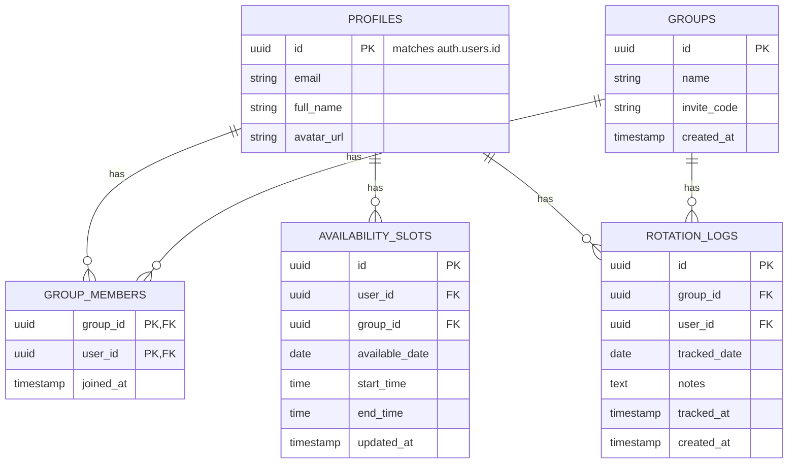

# Database Schema & Security

## 1. Purpose
Define the data structures, relationships, security policies (RLS), and optimization strategies for PostgreSQL on Supabase.

## 2. Entity Relationship Diagram (ERD)

## 3. Table Explanations
- **`profiles`**: Stores user information. Automatically populated via database trigger when a new user signs up in `auth.users`.
- **`groups`**: Stores group details and a unique `invite_code` for sharing.
- **`group_members`**: Junction table linking users to groups.
- **`availability_slots`**: Stores time ranges when a user is free. Linked to both `user_id` and `group_id` so users can have different availability per group.
- **`rotation_logs`**: Stores log records for member rotation tracking, recording which member tracked in which group, on what date, at what time, and with optional description notes.

## 4. Row Level Security (RLS) Strategy
- **`profiles`**:
  - `SELECT`: Public or Authenticated users can view basic profile info.
  - `UPDATE`: Users can only update their own profile (`auth.uid() = id`).
- **`groups`**:
  - `SELECT`: Members of the group can view the group details.
  - `INSERT`: Authenticated users can create groups.
- **`group_members`**:
  - `SELECT`: Users can view memberships of groups they belong to.
  - `INSERT`: Users can join if they have the valid `invite_code`.
- **`availability_slots`**:
  - `SELECT`: Users can view availability of members in the same group.
  - `INSERT/UPDATE/DELETE`: Users can only modify their own slots (`auth.uid() = user_id`).

## 5. Index Suggestions
- `CREATE INDEX idx_group_members_user_id ON group_members(user_id);`
- `CREATE INDEX idx_availability_group_date ON availability_slots(group_id, available_date);` (Optimizes querying common free times for a specific group and date).

## 6. Realtime Subscription Strategy
- Enable Supabase Realtime on `availability_slots` table.
- Clients subscribe to `availability_slots` changes where `group_id = current_group_id`.
