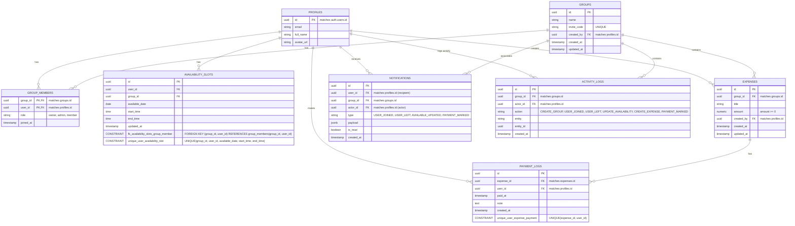

# Database Schema & Security

## 1. Purpose
Define the data structures, relationships, security policies (RLS), and optimization strategies for PostgreSQL on Supabase.

## 2. Entity Relationship Diagram (ERD)

## 3. Table Explanations
- **`profiles`**: Stores user information. Automatically populated via database trigger when a new user signs up in `auth.users`.
- **`groups`**: Stores group details, the creator (`created_by`), and a unique `invite_code` for sharing.
- **`group_members`**: Junction table linking users to groups, including their `role` (owner, admin, member).
- **`availability_slots`**: Stores time ranges when a user is free. Verified by foreign key constraint to ensure they are active group members.
- **`expenses`**: Groups shared expenses (e.g. rent, internet, electricity) with amount and creator details.
- **`payment_logs`**: Records payment confirmations where users manually declare they paid a specific expense.
- **`notifications`**: User-specific notification records generated automatically on group events.
- **`activity_logs`**: Audit logs capturing all major modifications inside groups for history and debugging.

## 4. Row Level Security (RLS) Strategy
- **`profiles`**:
  - `SELECT`: Public or Authenticated users can view basic profile info.
  - `UPDATE`: Users can only update their own profile (`auth.uid() = id`).
- **`groups`**:
  - `SELECT`: Members of the group can view the group details.
  - `INSERT`: Authenticated users can create groups.
- **`group_members`**:
  - `SELECT`: Users can view memberships of groups they belong to.
  - `INSERT`: Users can join if they have the valid `invite_code`.
- **`availability_slots`**:
  - `SELECT`: Users can view availability of members in the same group.
  - `INSERT/UPDATE/DELETE`: Users can only modify their own slots (`auth.uid() = user_id`).
- **`expenses`**:
  - `SELECT`/`INSERT`: Group members can view/insert expenses.
  - `UPDATE`/`DELETE`: Expense creators or group owners/admins can modify.
- **`payment_logs`**:
  - `SELECT`/`INSERT`: Group members can view/insert their own payments.
  - `DELETE`: Payment log creators can remove.
- **`notifications`**:
  - `SELECT`/`UPDATE`/`DELETE`: Users can manage their own notification records (`user_id = auth.uid()`).
- **`activity_logs`**:
  - `SELECT`: Group members can view activity logs for groups they belong to.
  - `INSERT`/`UPDATE`/`DELETE`: Database triggers only.

## 5. Optimization Indexes
- `idx_availability_slots_group_date`: Optimizes query of free times on group & date.
- `idx_notifications_user_created`: Optimizes loading of user's unread notifications feed sorted by date.
- `idx_payment_logs_expense_id`: Optimizes list of payments for an expense.

## 6. Realtime Subscription Strategy
- Enable Supabase Realtime on `availability_slots` (for calendar sync), `payment_logs`/`expenses` (for payment dashboard updates), and `notifications` (for real-time toast alerts).
